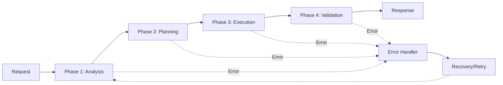

# Phased Orchestrator Agent Template Documentation

Welcome to the **AgenticAI Phased Orchestrator Agent Template** documentation. This template provides a production-ready foundation for building intelligent agents that orchestrate complex workflows through multiple phases.

## 📖 Quick Links

- [**Getting Started**](guides/getting-started.md) - Setup and first agent
- [**Architecture**](architecture/README.md) - System design and patterns
- [**API Reference**](api-reference/README.md) - Complete API documentation
- [**Examples**](examples/README.md) - Practical code examples
- [**Contributing**](contributing/README.md) - How to contribute

---

## 🎯 What is the Phased Orchestrator Template?

The Phased Orchestrator template is designed for agents that execute complex workflows by breaking them down into distinct phases. Each phase represents a logical step in the workflow, allowing for:

- **Sequential Processing**: Execute phases in order with clear transitions
- **State Management**: Maintain context across phases
- **Error Recovery**: Handle failures at any phase
- **Progress Tracking**: Monitor workflow execution status
- **A2A Integration**: Communicate with other agents via Agent-to-Agent protocol

### Key Features

✅ **Multi-Phase Workflow Engine**: Built-in support for defining and executing phased workflows  
✅ **State Persistence**: Conversation memory with Azure Cosmos DB  
✅ **Agent-to-Agent (A2A) Protocol**: Standard communication interface for agent collaboration  
✅ **Custom Tool Integration**: Easily add domain-specific tools  
✅ **Azure OpenAI Integration**: Leverage powerful LLM capabilities  
✅ **Observability Built-in**: Application Insights for monitoring and debugging  
✅ **Infrastructure as Code**: Terraform modules for Azure deployment  
✅ **CLI Management Tools**: Built-in commands for operations and deployment  
✅ **Docker Support**: Container-ready for production deployment

---

## 🚀 Quick Start

### Installation

```powershell
# Navigate to your agent directory
cd my-phased-agent

# Install dependencies
uv pip install -e ".[dev]"
```

### Configuration

1. Copy the environment template:
   ```powershell
   Copy-Item .env.example .env.development
   ```

2. Configure your Azure credentials in `.env.development`:
   ```env
   AZURE_OPENAI_ENDPOINT=https://your-instance.openai.azure.com
   AZURE_OPENAI_API_KEY=your-api-key
   AZURE_OPENAI_DEPLOYMENT_NAME=gpt-4o
   
   COSMOSDB_ENDPOINT=https://your-cosmos.documents.azure.com:443/
   COSMOSDB_KEY=your-cosmos-key
   ```

### Run the Agent

```powershell
# Development mode with auto-reload
agenticai dev .

# Production mode
agenticai run . --port 8000

# Docker mode
agenticai build .
agenticai run . --mode docker
```

---

## 📚 Documentation Sections

### [Guides](guides/README.md)

Step-by-step guides for common tasks:
- [Getting Started](guides/getting-started.md) - Installation and first workflow
- [Defining Phases](guides/defining-phases.md) - Create multi-phase workflows
- [Adding Custom Tools](guides/adding-tools.md) - Extend agent capabilities
- [State Management](guides/state-management.md) - Persist and query workflow state
- [A2A Communication](guides/a2a-communication.md) - Interact with other agents
- [Debugging](guides/debugging.md) - Debug workflows and tools
- [Deployment](guides/deployment.md) - Deploy to Azure

### [Architecture](architecture/README.md)

System design and technical details:
- [Overview](architecture/README.md#overview) - System architecture
- [Workflow Engine](architecture/README.md#workflow-engine) - Phase orchestration
- [State Management](architecture/README.md#state-management) - Memory patterns
- [A2A Protocol](architecture/README.md#a2a-protocol) - Agent communication
- [Tool System](architecture/README.md#tool-system) - Tool architecture
- [Security](architecture/README.md#security) - Authentication and authorization

### [API Reference](api-reference/README.md)

Complete API documentation:
- [A2A Server](api-reference/README.md#a2a-server) - Server initialization and configuration
- [Workflow Engine](api-reference/README.md#workflow-engine) - Phase execution APIs
- [Tools](api-reference/README.md#tools) - Tool registration and decorators
- [CLI Commands](api-reference/README.md#cli-commands) - Management CLI reference
- [Configuration](api-reference/README.md#configuration) - Settings and environment

### [Examples](examples/README.md)

Practical code examples:
- [Simple Sequential Workflow](examples/README.md#simple-sequential-workflow)
- [Conditional Phase Execution](examples/README.md#conditional-phase-execution)
- [Custom Tool Integration](examples/README.md#custom-tool-integration)
- [A2A Agent Communication](examples/README.md#a2a-agent-communication)
- [Error Handling Patterns](examples/README.md#error-handling-patterns)

### [Contributing](contributing/README.md)

How to contribute to this template:
- [Development Setup](contributing/README.md#development-setup)
- [Coding Standards](contributing/README.md#coding-standards)
- [Testing Guidelines](contributing/README.md#testing-guidelines)
- [Pull Request Process](contributing/README.md#pull-request-process)

---

## 🔄 Typical Workflow Lifecycle



1. **Request Reception**: Receive task via A2A protocol or direct invocation
2. **Phase Execution**: Execute each phase sequentially
3. **State Updates**: Persist state after each phase
4. **Error Handling**: Automatic recovery and retry logic
5. **Response**: Return results via A2A protocol

---

## 🛠️ Key Components

### Workflow Engine
Orchestrates phase execution with state management and error handling.

### Tool Registry
Manages custom tools that extend agent capabilities.

### A2A Server
Implements the Agent-to-Agent protocol for standardized communication.

### State Persistence
Azure Cosmos DB integration for conversation memory and state storage.

### CLI Tools
Built-in commands for infrastructure management and operations.

---

## 🏗️ Project Structure

```
my-phased-agent/
├── a2a_server.py              # A2A server entry point
├── __main__.py                # Python module entry
├── pyproject.toml             # Dependencies and metadata
├── Dockerfile                 # Container configuration
│
├── cli/                       # CLI tools
│   ├── main.py                # CLI entry point
│   └── commands/
│       └── iac.py             # Infrastructure commands
│
├── terraform/                 # Infrastructure as Code
│   ├── main.tf                # Main configuration
│   ├── modules/               # Reusable modules
│   └── environments/          # Environment-specific configs
│
├── configs/                   # Configuration files
│   └── config.yaml            # Agent configuration
│
├── tools/                     # Custom tools
│   ├── __init__.py
│   └── example_tool.py        # Example tool implementation
│
├── docs/                      # Documentation
│   ├── README.md              # This file
│   ├── guides/                # User guides
│   ├── architecture/          # Architecture docs
│   ├── api-reference/         # API reference
│   ├── examples/              # Code examples
│   └── contributing/          # Contribution guide
│
└── .agenticai.yaml            # Agent CLI configuration
```

---

## 🌟 Use Cases

This template is ideal for:

- **Multi-Step Data Processing**: ETL pipelines with validation phases
- **Report Generation**: Analysis → Planning → Execution → Formatting
- **Approval Workflows**: Request → Review → Approval → Execution
- **Complex Analysis**: Data collection → Processing → Insight generation
- **Orchestration Tasks**: Coordinate multiple sub-agents for complex tasks

---

## 🔗 Related Resources

- [AgenticAI SDK](https://github.com/bayer-int/agentic_ai_sdk) - Core framework
- [AgenticAI CLI](../agentic_ai_cli/docs/README.md) - Management CLI
- [MCP Server Template](../agentic_ai_template_mcp_server/docs/README.md) - MCP integration
- [Infrastructure Template](../agentic_ai_template_usecase_infrastructure/docs/README.md) - Infrastructure patterns

---

## 🆘 Support

- **Issues**: Report bugs or request features on GitHub
- **Discussions**: Ask questions and share ideas
- **Documentation**: Check guides and examples for solutions
- **Community**: Join the AgenticAI community

---

## 📋 Prerequisites

- Python 3.11 or higher
- Azure OpenAI access (API key or Managed Identity)
- Azure Cosmos DB instance (for state persistence)
- Azure subscription (for cloud deployment)
- Docker (optional, for containerization)
- Terraform (optional, for infrastructure automation)

---

## 🎓 Learning Path

1. **Start here**: [Getting Started Guide](guides/getting-started.md)
2. **Understand workflows**: [Defining Phases](guides/defining-phases.md)
3. **Add functionality**: [Adding Custom Tools](guides/adding-tools.md)
4. **Deploy**: [Deployment Guide](guides/deployment.md)
5. **Scale**: [Architecture Documentation](architecture/README.md)

---

**Happy Building! 🚀**
