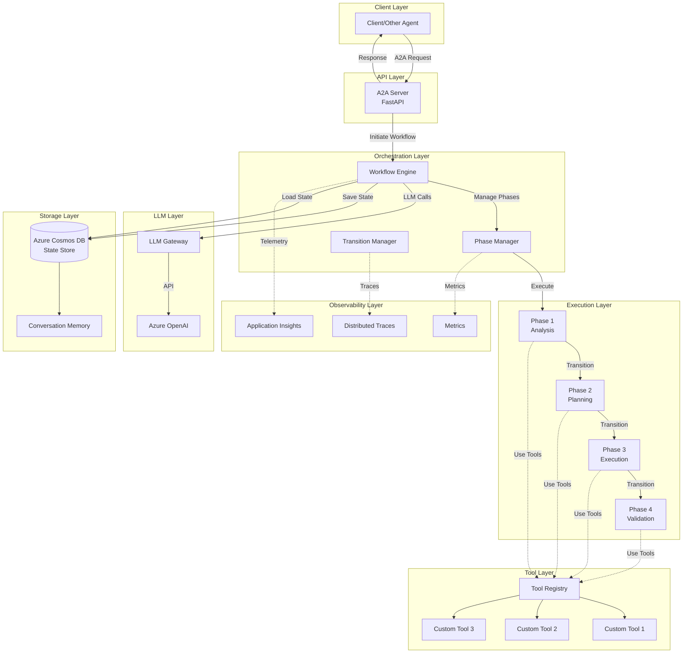
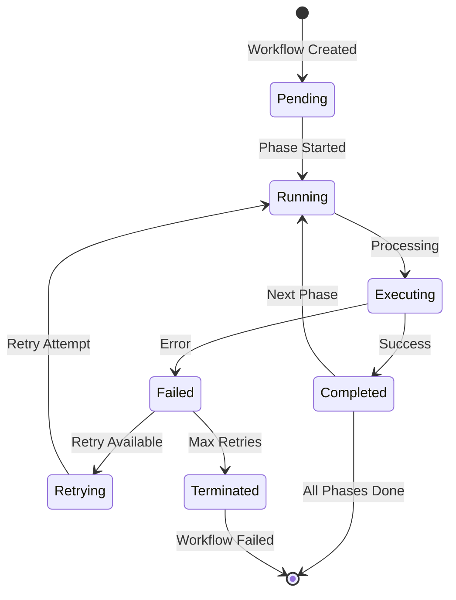
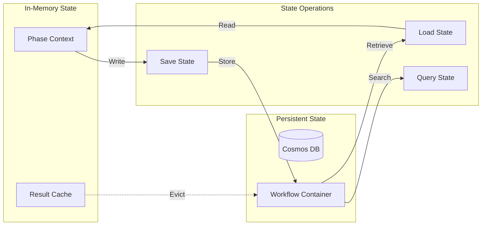
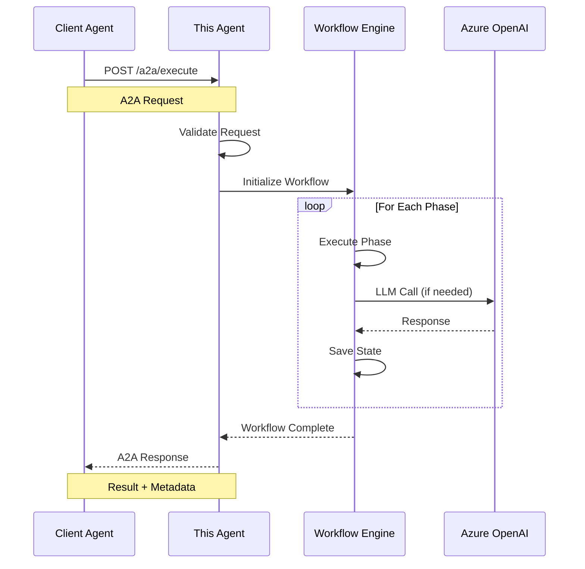
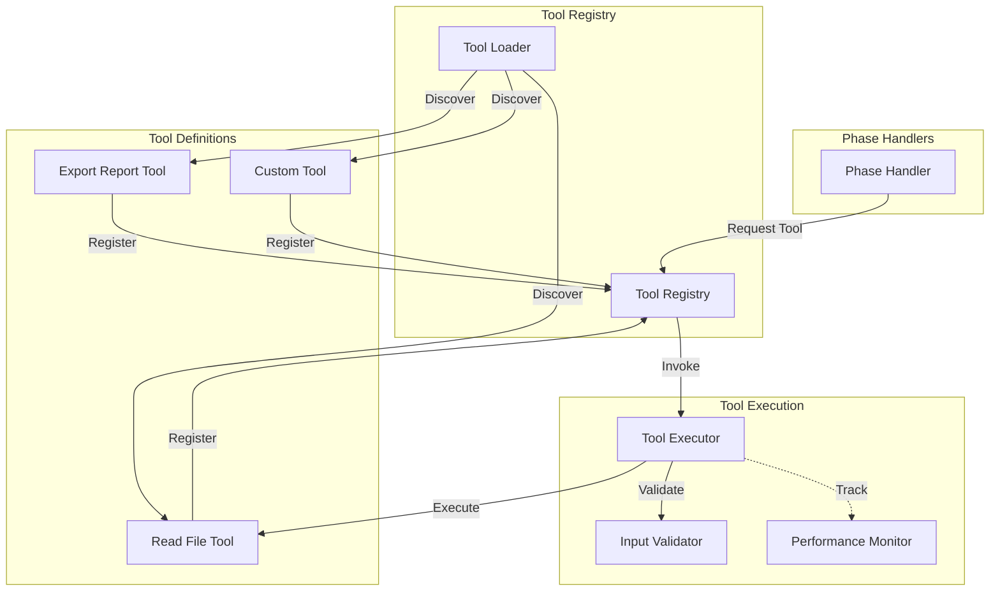
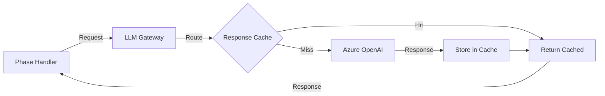
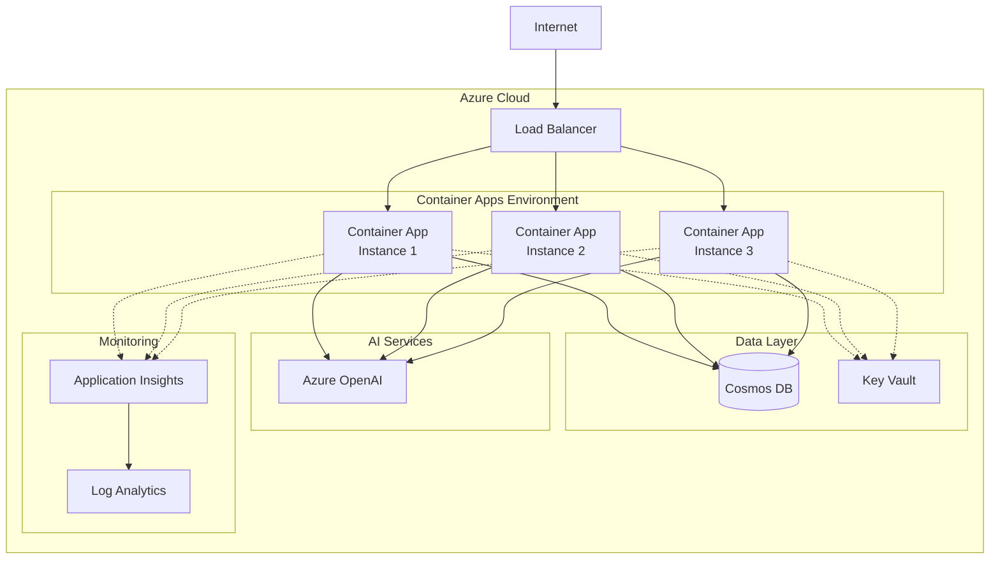

# Phased Orchestrator Architecture

This document describes the architecture, design patterns, and technical implementation of the Phased Orchestrator Agent Template.

## 📋 Table of Contents

- [Overview](#overview)
- [System Architecture](#system-architecture)
- [Workflow Engine](#workflow-engine)
- [State Management](#state-management)
- [A2A Protocol](#a2a-protocol)
- [Tool System](#tool-system)
- [LLM Integration](#llm-integration)
- [Security](#security)
- [Deployment Architecture](#deployment-architecture)

---

## Overview

The Phased Orchestrator template implements a **multi-phase workflow execution engine** that orchestrates complex tasks through sequential phases, each with its own logic, tools, and state management.

### Design Principles

1. **Phase Isolation**: Each phase is independent and testable
2. **State Persistence**: Workflow state is preserved across phases
3. **Error Recovery**: Automatic retry and error handling
4. **Observability**: Comprehensive logging and telemetry
5. **Scalability**: Horizontal scaling with stateless design
6. **Extensibility**: Easy to add new phases and tools

---

## System Architecture



### Component Overview

| Component | Responsibility | Technology |
|-----------|---------------|------------|
| **A2A Server** | API endpoint for agent communication | FastAPI |
| **Workflow Engine** | Orchestrates phase execution | Custom Python |
| **Phase Manager** | Manages phase lifecycle | AgenticAI SDK |
| **Tool Registry** | Manages and executes tools | AgenticAI SDK |
| **LLM Gateway** | Routes LLM requests | Azure OpenAI |
| **State Store** | Persists workflow state | Azure Cosmos DB |
| **Observability** | Monitoring and tracing | Application Insights |

---

## Workflow Engine

The workflow engine orchestrates the execution of multiple phases in sequence.

### Phase Lifecycle



### Key Concepts

#### Phase Definition

Each phase represents a discrete step in the workflow:

```python
class Phase:
    """Represents a workflow phase."""
    
    def __init__(
        self,
        name: str,
        handler: Callable,
        retry_policy: RetryPolicy,
        timeout: int = 300
    ):
        self.name = name
        self.handler = handler
        self.retry_policy = retry_policy
        self.timeout = timeout
        
    async def execute(self, context: PhaseContext) -> PhaseResult:
        """Execute the phase with context."""
        pass
```

#### Phase Context

Shared state passed between phases:

```python
@dataclass
class PhaseContext:
    """Context shared across phases."""
    workflow_id: str
    current_phase: str
    state: Dict[str, Any]
    metadata: Dict[str, Any]
    previous_results: List[PhaseResult]
```

#### Phase Transitions

Control flow between phases:

```python
class TransitionManager:
    """Manages phase transitions."""
    
    def determine_next_phase(
        self,
        current: Phase,
        result: PhaseResult,
        context: PhaseContext
    ) -> Optional[Phase]:
        """Determine the next phase based on result."""
        # Conditional logic
        if result.status == "completed":
            return self.get_next_sequential_phase(current)
        elif result.status == "retry":
            return current  # Retry same phase
        else:
            return None  # Terminate workflow
```

### Execution Flow

1. **Initialization**: Create workflow context
2. **Phase Selection**: Select first phase
3. **Pre-Execution**: Load phase dependencies
4. **Execution**: Run phase handler
5. **Post-Execution**: Save phase result
6. **Transition**: Determine next phase
7. **Repeat**: Continue until complete or failed

---

## State Management

State management ensures workflow continuity across phases and system restarts.

### State Architecture



### State Schema

```json
{
  "id": "workflow-uuid",
  "workflow_id": "wf-12345",
  "agent_id": "my-agent",
  "status": "running",
  "current_phase": "execution",
  "phases": [
    {
      "name": "analysis",
      "status": "completed",
      "started_at": "2024-01-15T10:00:00Z",
      "completed_at": "2024-01-15T10:02:30Z",
      "result": { }
    }
  ],
  "context": {
    "user_input": "...",
    "accumulated_data": { }
  },
  "created_at": "2024-01-15T10:00:00Z",
  "updated_at": "2024-01-15T10:05:00Z",
  "ttl": 86400
}
```

### State Operations

#### Save State

```python
async def save_workflow_state(
    workflow_id: str,
    context: PhaseContext,
    cosmos_client: CosmosClient
) -> None:
    """Persist workflow state to Cosmos DB."""
    container = cosmos_client.get_container("workflows")
    
    state_document = {
        "id": workflow_id,
        "workflow_id": workflow_id,
        "status": context.status,
        "current_phase": context.current_phase,
        "context": context.state,
        "updated_at": datetime.utcnow().isoformat()
    }
    
    await container.upsert_item(state_document)
```

#### Load State

```python
async def load_workflow_state(
    workflow_id: str,
    cosmos_client: CosmosClient
) -> Optional[PhaseContext]:
    """Retrieve workflow state from Cosmos DB."""
    container = cosmos_client.get_container("workflows")
    
    try:
        document = await container.read_item(
            item=workflow_id,
            partition_key=workflow_id
        )
        return PhaseContext.from_dict(document)
    except CosmosResourceNotFoundError:
        return None
```

---

## A2A Protocol

Agent-to-Agent protocol implementation for standardized communication.

### Protocol Architecture



### A2A Request Schema

```json
{
  "request_id": "req-uuid",
  "agent_id": "requesting-agent",
  "task": {
    "type": "workflow",
    "description": "Process quarterly data",
    "parameters": {
      "quarter": "Q4",
      "year": 2024
    }
  },
  "context": {
    "conversation_id": "conv-123",
    "user_id": "user-456"
  },
  "metadata": {
    "priority": "high",
    "deadline": "2024-01-20T18:00:00Z"
  }
}
```

### A2A Response Schema

```json
{
  "request_id": "req-uuid",
  "workflow_id": "wf-12345",
  "status": "completed",
  "result": {
    "summary": "Quarterly analysis complete",
    "phases_executed": ["analysis", "planning", "execution", "validation"],
    "output": { }
  },
  "execution_time_ms": 2547,
  "metadata": {
    "agent_version": "1.0.0",
    "timestamp": "2024-01-15T10:05:47Z"
  }
}
```

---

## Tool System

Extensible tool system for adding custom capabilities.

### Tool Architecture



### Tool Interface

```python
from agenticai.tools import tool_registry, Tool

@tool_registry.register
class CustomTool(Tool):
    """Custom tool for domain-specific operations."""
    
    name: str = "custom_tool"
    description: str = "Performs custom operation"
    
    async def execute(self, **kwargs) -> Dict[str, Any]:
        """Execute the tool with given parameters."""
        # Tool logic here
        return {"status": "success", "data": result}
    
    def validate_input(self, **kwargs) -> bool:
        """Validate input parameters."""
        required_params = ["param1", "param2"]
        return all(p in kwargs for p in required_params)
```

---

## LLM Integration

Azure OpenAI integration for intelligent processing.

### LLM Gateway Pattern



### Prompt Engineering

Templates for consistent LLM interactions:

```python
PHASE_ANALYSIS_PROMPT = """
You are analyzing {task_description}.

Context:
{context}

Previous Results:
{previous_results}

Perform a thorough analysis and provide:
1. Key findings
2. Identified patterns
3. Recommendations for next phase

Output as JSON.
"""
```

---

## Security

Security considerations and best practices.

### Authentication & Authorization

- **Azure Managed Identity**: For Azure service authentication
- **API Keys**: Secured in Azure Key Vault
- **RBAC**: Role-based access control for API endpoints

### Data Protection

- **Encryption at Rest**: Cosmos DB encryption
- **Encryption in Transit**: TLS 1.2+ for all connections
- **Secrets Management**: Azure Key Vault integration
- **PII Handling**: Automatic redaction in logs

### Network Security

- **Virtual Network**: Deploy within VNet
- **Private Endpoints**: Private connectivity to Azure services
- **NSG Rules**: Restrict inbound/outbound traffic

---

## Deployment Architecture

Azure deployment architecture for production.



### Key Components

- **Azure Container Apps**: Serverless container hosting
- **Azure Cosmos DB**: NoSQL database for state
- **Azure OpenAI**: LLM processing
- **Application Insights**: Monitoring and diagnostics
- **Key Vault**: Secrets management
- **Virtual Network**: Network isolation

---

## Performance Considerations

### Optimization Strategies

1. **Phase Parallelization**: Execute independent phases concurrently
2. **Response Caching**: Cache LLM responses for common queries
3. **Connection Pooling**: Reuse database connections
4. **Lazy Loading**: Load tools only when needed
5. **Batch Processing**: Group multiple operations

### Scaling Patterns

- **Horizontal Scaling**: Add more container instances
- **Partitioning**: Partition workflows by ID
- **Read Replicas**: Use Cosmos DB read replicas
- **CDN**: Cache static responses

---

## Monitoring & Observability

### Metrics

- Phase execution time
- Workflow success/failure rate
- LLM token usage
- Database query performance

### Distributed Tracing

OpenTelemetry integration for end-to-end tracing across phases.

### Alerting

- Phase failures exceed threshold
- LLM rate limiting
- Database connection failures
- High latency alerts

---

## Related Documentation

- [API Reference](../api-reference/README.md) - Detailed API documentation
- [Deployment Guide](../guides/deployment.md) - Production deployment
- [Examples](../examples/README.md) - Architecture patterns in action

---

**Last Updated**: December 2025
