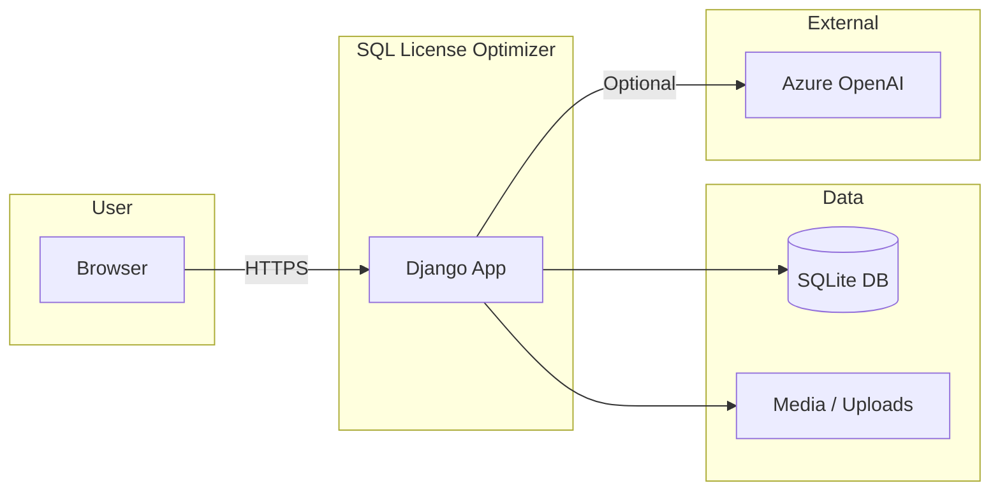
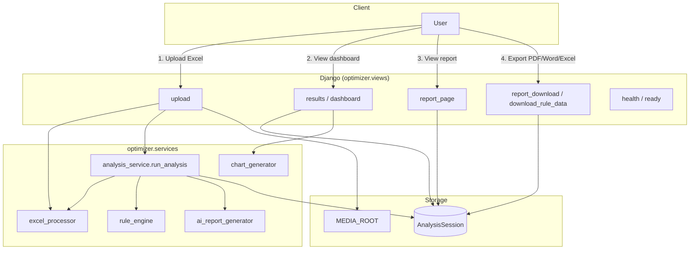
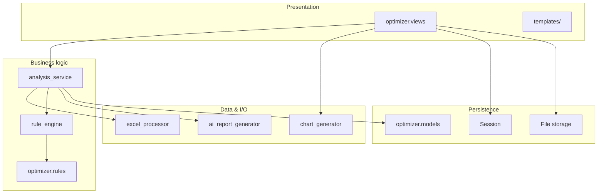
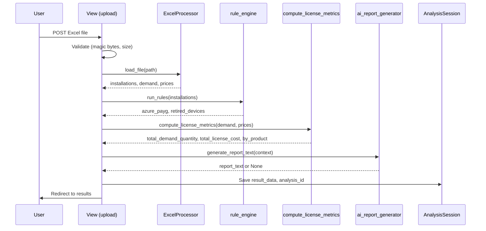
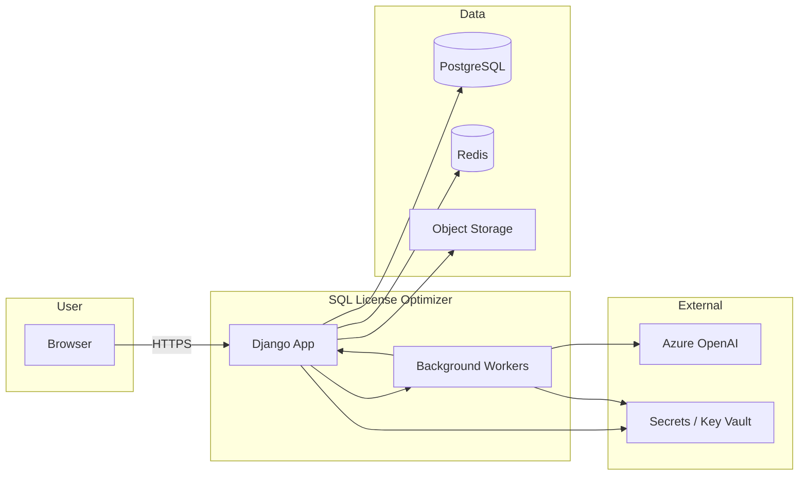
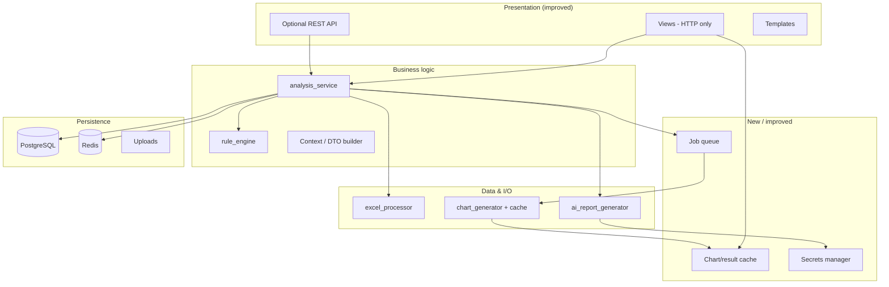
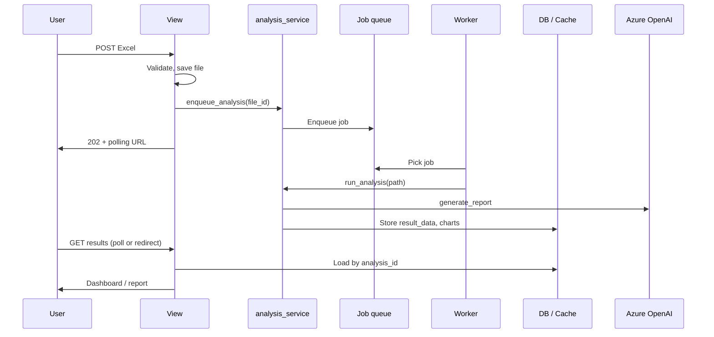
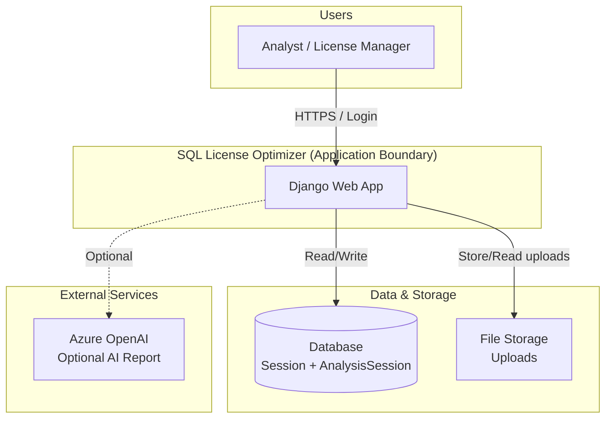
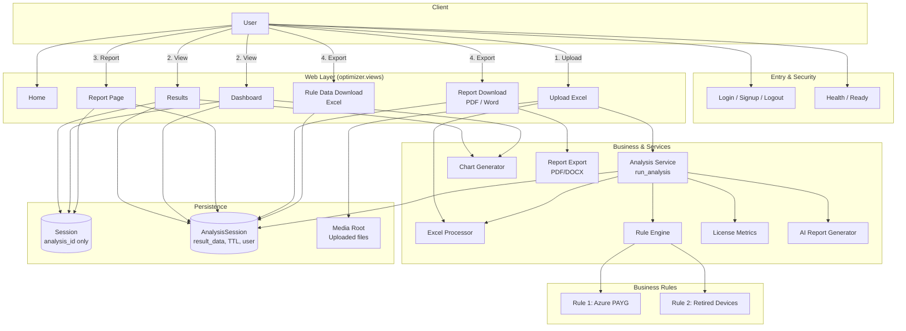
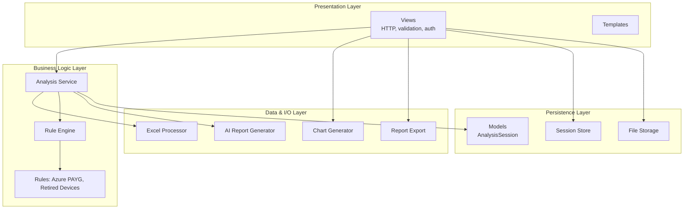

# Architecture Diagrams

README-style architecture documentation with Mermaid diagrams. Diagrams render on GitHub, GitLab, and most Markdown viewers that support Mermaid.

---

## 1. Current Architecture (As-Built)

High-level flow and components of the SQL License Optimizer as implemented today.

### 1.1 System Context



### 1.2 Request and Data Flow



### 1.3 Component Layering (Current)



### 1.4 Upload-to-Results Pipeline (Current)



---

## 2. Target Architecture (Improvements)

What to add or change, based on [ENTERPRISE_IMPROVEMENTS.md](ENTERPRISE_IMPROVEMENTS.md).

### 2.1 Target System Context



### 2.2 Target Layering and New Components



### 2.3 Target Request Flow (Async Option)



### 2.4 Improvement Map (Summary)

| Area | Current | Target |
|------|---------|--------|
| **Secrets** | Env vars, .env | Env + optional Key Vault; no defaults in prod |
| **Auth** | Django auth, @login_required | + RBAC, optional SSO/OIDC |
| **Session** | DB session, analysis_id only | + Redis option; strict TTL |
| **Processing** | Synchronous in request | Optional: queue (Celery/RQ), async + polling |
| **Charts** | Generated every request | Cache by analysis_id; invalidate on new analysis |
| **Database** | SQLite | PostgreSQL in production |
| **Uploads** | Local MEDIA_ROOT | Object storage (S3/Azure Blob) in prod |
| **Logging** | Console | Structured (JSON), request_id, file/rotate in prod |
| **Health** | /health, /ready | + dependency checks (DB, Redis, optional cache) |
| **Testing** | Some unit tests | Full coverage, CI, fixtures |
| **Settings** | Single settings.py | base + dev/staging/prod modules |
| **API** | HTML only | Optional versioned REST under /api/v1/ |
| **Frontend** | Tailwind CDN | Built Tailwind, pinned deps, a11y |

---

## 3. Enterprise Architecture Overview

This section describes the **SQL License Optimizer** in a single, enterprise-friendly view: what the system does, how data and control flow, and where security and operations apply. Use this when explaining the application to stakeholders, architecture boards, or compliance.

### 3.1 What the Application Does

The SQL License Optimizer is a **web application** that lets authorized users:

1. **Upload** Excel workbooks (installations, demand, prices, optimization data).
2. **Analyze** them through configurable business rules (e.g. Azure PAYG identification, retired devices) and license metrics.
3. **View** results in a tabbed dashboard with charts and an executive report (optionally AI-generated).
4. **Export** reports (PDF/Word) and rule-specific data (Excel) for traceability and audit.

All optimizer actions are **authenticated**; sessions store only an analysis reference; results are persisted with **TTL and ownership** checks. Health and readiness endpoints support **load balancers and orchestrators**.

### 3.2 Enterprise System Context



**Summary for enterprise:** Users interact only with the web app over HTTPS. The app owns database and file storage; the only external dependency is optional Azure OpenAI for report generation.

### 3.3 End-to-End Application Flow (All Functionalities)

This diagram shows how a request moves through the system and where each capability lives.



**Flow in words:**

| Step | User action | System behavior |
|------|-------------|-----------------|
| **0** | Access app | Auth (login/signup); Health/Ready for probes. |
| **1** | Upload Excel | File validated (magic bytes, size), saved to Media; Analysis Service loads sheets (Excel Processor), runs Rule Engine (Rule 1 + Rule 2), computes License Metrics, optionally calls Azure OpenAI for report text; result stored in AnalysisSession; session stores only `analysis_id`. |
| **2** | View results/dashboard | Load context by `analysis_id` from AnalysisSession (TTL + ownership checked); Chart Generator builds visuals from result_data. |
| **3** | View report | Same context load; executive summary (AI or fallback) and export options. |
| **4** | Export | Report Download (PDF/Word) or Rule Data Download (Excel); data from AnalysisSession; filenames include analysis ID for traceability. |

### 3.4 Logical Architecture (Layers)



**Enterprise takeaway:** Clear separation: presentation handles HTTP and auth; business layer runs analysis and rules; data layer handles Excel, charts, and AI; persistence holds session, analysis results, and files.

### 3.5 Security and Operations Touchpoints

```mermaid
flowchart LR
    subgraph Security["Security"]
        A1[Authentication\nLogin / Session]
        A2[Authorization\n@login_required]
        A3[Input validation\nMagic bytes, size, whitelist]
        A4[Ownership & TTL\nAnalysisSession]
    end
    subgraph Operations["Operations"]
        O1[Health / Ready\nProbes]
        O2[Structured logging\nRequest ID]
        O3[Cleanup\ncleanup_uploads]
        O4[Config\nEnv, feature flags]
    end
    User((User)) --> A1
    A1 --> A2
    A2 --> A3
    A3 --> A4
    App((App)) --> O1
    App --> O2
    O2 --> O3
    O4 --> App
```

| Area | What the application does |
|------|----------------------------|
| **Authentication** | Login/signup/logout; session cookie (secure in production). |
| **Authorization** | All optimizer views require login; results tied to user where applicable. |
| **Input validation** | File type (magic bytes), size limit, whitelisted export formats and rule IDs. |
| **Ownership & TTL** | Analysis loaded by session `analysis_id`; ownership and TTL checked; expired analyses redirect with message. |
| **Health / Ready** | Endpoints for load balancer and orchestrator. |
| **Logging** | Request ID, structured logs; no PII in logs. |
| **Cleanup** | Management command to delete old uploads (retention policy). |
| **Configuration** | Environment-based (and optional Key Vault); feature flags for AI and charts. |

---

## How to View

- **GitHub / GitLab**: Open this file in the repo; Mermaid blocks render automatically.
- **VS Code**: Use a Markdown preview extension that supports Mermaid (e.g. Markdown Preview Mermaid Support).
- **Export**: Use [Mermaid Live Editor](https://mermaid.live) or CLI to export diagrams as PNG/SVG.
